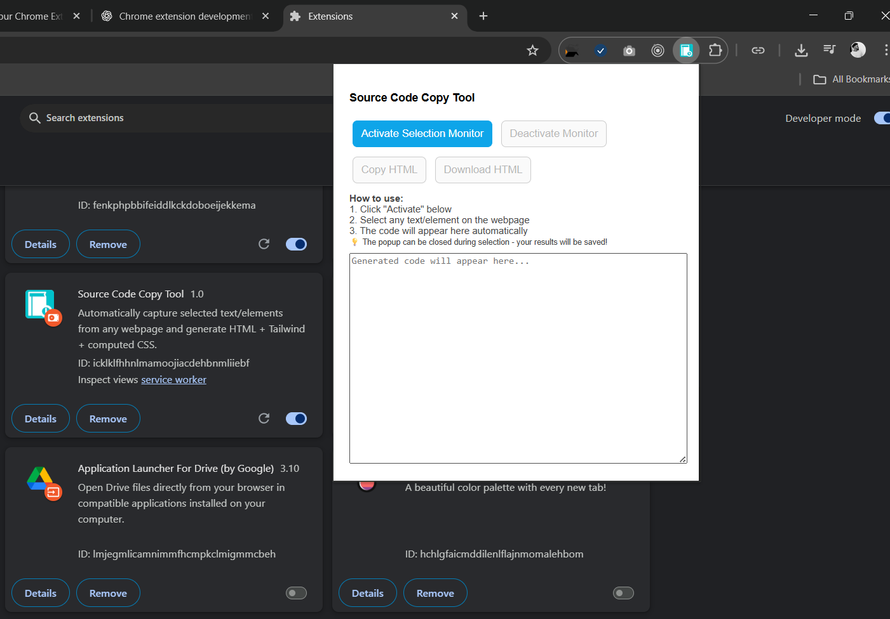

# Source Code Copy Tool (Chrome Extension)

A Chrome extension that lets you **select any rectangular section of a webpage** and download its **HTML + computed CSS** wrapped with **Tailwind CSS**.  
This allows you to copy-paste the output directly into your code editor and maintain the same UI look.

---

## ✨ Features
- Select any **section** of a webpage by dragging a rectangle.
- Extracts the underlying HTML + inline computed CSS.
- Automatically includes **Tailwind CSS CDN** so you can continue styling with utilities.
- Copy the generated code or download it as an `.html` file.
- Works on **every webpage**.

---

## 📸 Screenshot

---

## 🚀 Installation
1. Download or clone this repository.
2. Open Chrome and go to `chrome://extensions/`.
3. Enable **Developer mode** (top-right).
4. Click **Load unpacked** and select the folder `Source code copy tool`.

---

## 🖱 Usage
1. Click the extension icon in Chrome.
2. In the popup, press **Select Section**.
3. Drag a rectangle over the part of the page you want to capture.
4. The extracted HTML + Tailwind CSS code will appear in the popup.
5. Use:
   - **Copy HTML** → Copies code to clipboard.
   - **Download HTML** → Saves code as `selected-section.html`.

---

## ⚠️ Notes & Limitations
- Cross-origin iframes and shadow DOM content may not copy correctly.
- The tool captures exact computed styles → not always converted into Tailwind utility classes.
- Tailwind is included via CDN (``).
- The section is extracted visually (rectangle), so it may include multiple nested elements.

---

